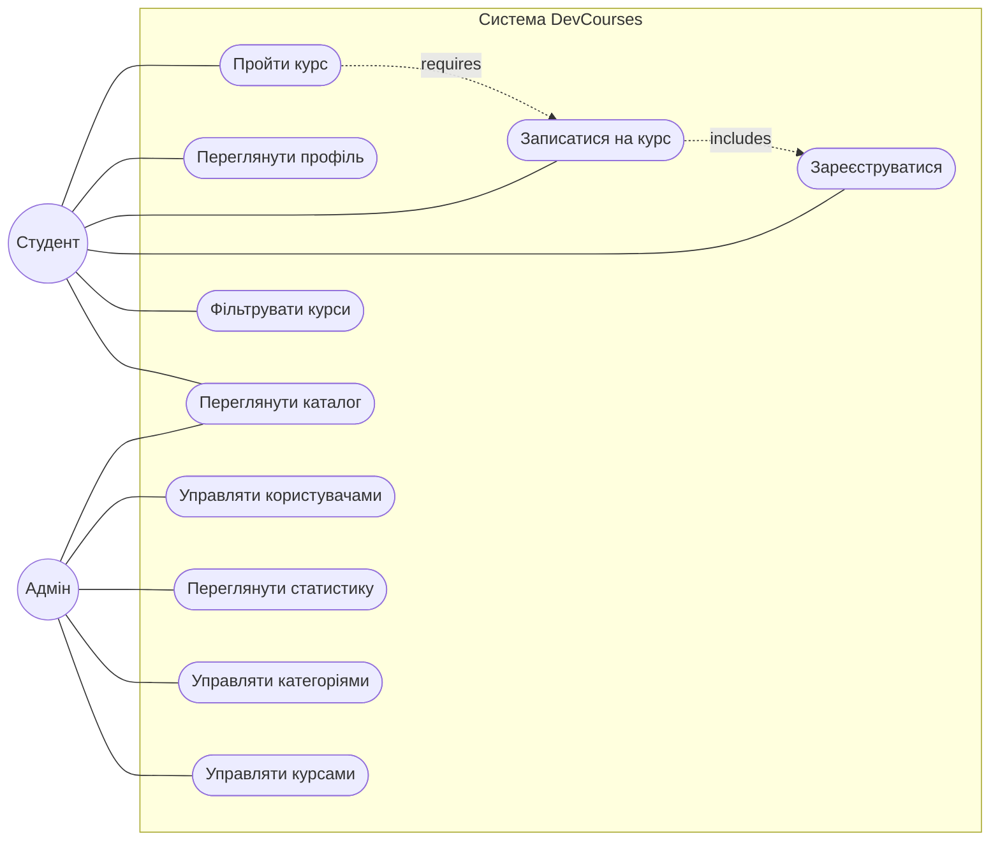
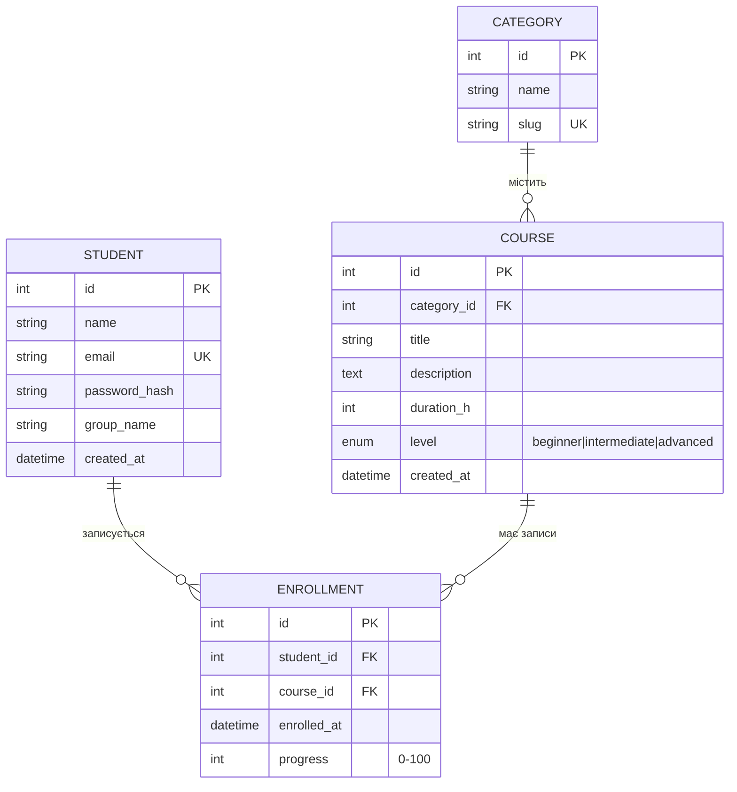
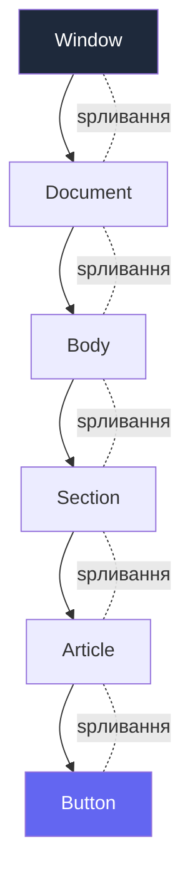
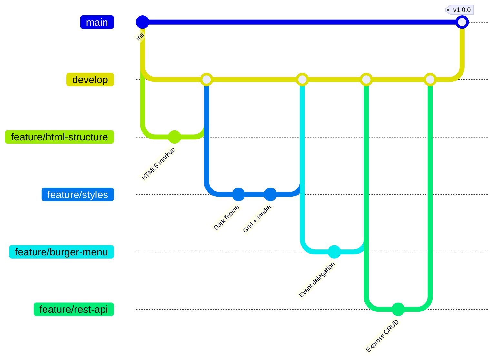

# Лабораторна робота №1

**Тема:** Розробка адаптивного веб-застосунку. Семантична HTML5-розмітка, CSS3, JavaScript-події, REST API на Node.js/Express.

**Дисципліна:** WEB-орієнтовані технології. Backend розробки

**Виконав:** студент групи ІО-31 Сас Євгеній Олександрович
**Перевірила:** Світлана Леонідівна Проскура

КПІ ім. Ігоря Сікорського, ФІОТ, кафедра ІСТ — Київ, 2026

---

## Зміст

1. [Мета роботи](#1-мета-роботи)
2. [Опис предметної області та бізнес-логіка](#2-опис-предметної-області-та-бізнес-логіка)
3. [Функціональні вимоги](#3-функціональні-вимоги)
4. [Нефункціональні вимоги](#4-нефункціональні-вимоги)
5. [Use Case діаграма](#5-use-case-діаграма)
6. [ER-діаграма](#6-er-діаграма)
7. [Архітектура застосунку](#7-архітектура-застосунку)
8. [Реалізація: HTML5 + CSS3](#8-реалізація-html5--css3)
9. [JavaScript: addEventListener, делегування подій, IntersectionObserver](#9-javascript-addeventlistener-делегування-подій-intersectionobserver)
10. [REST API на Express.js](#10-rest-api-на-expressjs)
11. [Тестування](#11-тестування)
12. [Версійний контроль Git](#12-версійний-контроль-git)
13. [Висновки](#13-висновки)
14. [Список використаних джерел](#14-список-використаних-джерел)

---

## 1. Мета роботи

Набути практичних навичок розробки фронтенд-частини адаптивного веб-застосунку платформи **DevCourses** (онлайн-каталог IT-курсів), а саме:

- Спроєктувати інформаційну систему: бізнес-логіка, функціональні та нефункціональні вимоги, Use Case і ER-діаграми;
- Реалізувати семантичну HTML5-розмітку з 6+ структурними тегами;
- Стилізувати інтерфейс у темній темі з використанням CSS Grid, Flexbox та media queries;
- Опанувати модель подій DOM: `addEventListener`, **bubbling/capturing**, **делегування подій**;
- Розробити базовий REST API на Express.js із повним CRUD-функціоналом.

---

## 2. Опис предметної області та бізнес-логіка

### 2.1 Предметна область

**DevCourses** — освітня IT-платформа, що надає каталог онлайн-курсів за різними напрямами розробки (Frontend, Backend, DevOps, Mobile, Data Science). Мета платформи — об'єднати студентів-початківців та практикуючих розробників із кваліфікованими менторами.

### 2.2 Актори системи

| Актор | Опис | Рівень доступу |
|-------|------|----------------|
| **Студент (гість)** | Перегляд каталогу, фільтрація, реєстрація | Публічний |
| **Студент (зареєстрований)** | Запис на курс, перегляд прогресу, проходження | Авторизований |
| **Адмін** | Управління курсами, категоріями, користувачами | Адміністративний |

### 2.3 Бізнес-процеси

**БП-1. Перегляд каталогу та запис на курс**

```
1. Студент відкриває сайт → завантажується головна сторінка
2. Переглядає каталог курсів (6 категорій × N курсів)
3. Фільтрує за категорією/рівнем (beginner/intermediate/advanced)
4. Обирає курс → переглядає опис, тривалість, програму
5. Натискає «Записатися» → створюється Enrollment
6. Отримує доступ до матеріалів курсу
```

**БП-2. Управління курсами адміністратором**

```
1. Адмін авторизується через JWT (реалізовано в ЛР3)
2. Створює нову категорію або редагує існуючу
3. Додає курс із прив'язкою до категорії (FK category_id)
4. Редагує метадані: title, description, duration, level
5. Видаляє застарілі курси (soft delete у production)
```

**БП-3. Адаптивний перегляд на різних пристроях**

```
- Десктоп (>1024px): сітка 3 колонки, повне меню
- Планшет (769–1024px): сітка 2 колонки, повне меню
- Мобільний (≤768px): сітка 1 колонка, бургер-меню
- Малий мобільний (≤480px): зменшені відступи, компактні картки
```

### 2.4 Бізнес-правила

- **БР-1.** Один курс належить рівно одній категорії (зв'язок 1:M).
- **БР-2.** Студент може бути записаний на необмежену кількість курсів (зв'язок M:N через Enrollment).
- **БР-3.** Курс має один із трьох рівнів складності: `beginner`, `intermediate`, `advanced`.
- **БР-4.** Email студента — унікальний ідентифікатор (логін).
- **БР-5.** Slug категорії — URL-дружня альтернатива id (для роутингу `/courses/frontend`).

---

## 3. Функціональні вимоги

| ID | Назва | Опис | Пріоритет |
|----|-------|------|-----------|
| **FR-001** | Адаптивна головна сторінка | Сторінка коректно відображається на екранах від 320px до 4K | High |
| **FR-002** | Семантична розмітка | HTML5 із тегами `header`, `nav`, `main`, `section`, `article`, `footer` | High |
| **FR-003** | Каталог курсів | Сітка з 6+ карток курсів із зображенням, назвою, описом, тривалістю | High |
| **FR-004** | Фільтрація | Бургер-меню для навігації між категоріями на мобільних | High |
| **FR-005** | Scroll-анімації | Картки з'являються плавно при скролі через IntersectionObserver | Medium |
| **FR-006** | Активна навігація | Підсвічування активного пункту меню при прокрутці | Medium |
| **FR-007** | REST API: GET /students | Отримання списку всіх студентів | High |
| **FR-008** | REST API: POST /students | Створення нового студента з валідацією email | High |
| **FR-009** | REST API: PUT /students/:id | Оновлення даних студента за ID | High |
| **FR-010** | REST API: DELETE /students/:id | Видалення студента за ID | High |
| **FR-011** | Обробка помилок API | Повернення 400, 404, 500 із JSON-описом помилки | High |
| **FR-012** | Делегування подій | Один обробник на батьківському елементі для N карток | Medium |

---

## 4. Нефункціональні вимоги

| ID | Категорія | Вимога |
|----|-----------|--------|
| **NFR-001** | Продуктивність | Час завантаження сторінки ≤ 2 с на 3G |
| **NFR-002** | Сумісність | Підтримка Chrome 90+, Firefox 88+, Safari 14+, Edge 90+ |
| **NFR-003** | Адаптивність | Брейкпоінти: 1024px, 768px, 480px |
| **NFR-004** | Доступність (a11y) | Семантичні теги, alt-атрибути, ARIA-ролі |
| **NFR-005** | SEO | Семантика HTML5, meta-теги, Open Graph |
| **NFR-006** | Безпека | Валідація вхідних даних на сервері (express.json + перевірки) |
| **NFR-007** | Підтримуваність | Розділення коду: HTML / CSS / JS / API |
| **NFR-008** | Версійність | Git Flow + Conventional Commits |

---

## 5. Use Case діаграма



**Опис прецедентів:**

- **UC1 «Переглянути каталог»** — основний прецедент для гостя. Не вимагає авторизації.
- **UC4 «Записатися на курс»** — *includes* UC3 (Реєстрація): не можна записатися без облікового запису.
- **UC6 «Пройти курс»** — *requires* UC4: проходження доступне лише після запису.
- **UC7-UC10** — адміністративні функції, потребують ролі `admin` (реалізовано в ЛР3).

---

## 6. ER-діаграма



**Пояснення зв'язків:**

- `CATEGORY ||--o{ COURSE` — одна категорія містить багато курсів (1:M через `category_id`).
- `STUDENT ||--o{ ENROLLMENT` та `COURSE ||--o{ ENROLLMENT` — зв'язок M:N між студентами та курсами розбито на дві 1:M через проміжну таблицю `ENROLLMENT`.
- **PK** — Primary Key, **FK** — Foreign Key, **UK** — Unique Key.

---

## 7. Архітектура застосунку

### 7.1 Загальна схема

```mermaid
flowchart TB
    Browser[Браузер користувача]

    subgraph Frontend[Frontend layer]
        HTML[index.html<br/>Semantic HTML5]
        CSS[style.css<br/>Grid + Flexbox + media queries]
        JS[main.js<br/>addEventListener + delegation]
    end

    subgraph Backend[Backend layer]
        Express[Express.js server<br/>:3000]
        Routes[CRUD routes<br/>/students]
        Memory[(In-memory store<br/>students[])]
    end

    Browser -->|HTTP GET| HTML
    HTML --> CSS
    HTML --> JS
    JS -->|fetch| Express
    Express --> Routes
    Routes --> Memory
```

### 7.2 Структура проєкту

```
lab1/
├── index.html          # Семантична розмітка
├── css/
│   └── style.css       # Темна тема, Grid, Flexbox, animations
├── js/
│   └── main.js         # Бургер-меню, делегування подій
├── api/
│   ├── server.js       # Express CRUD API
│   └── package.json
├── assets/             # Use Case + ER діаграми (PNG-резерв)
└── README.md
```

---

## 8. Реалізація: HTML5 + CSS3

### 8.1 Семантична HTML5-розмітка

```html
<header>
  <nav>
    <a class="logo">DevCourses</a>
    <button class="burger" aria-label="Меню">☰</button>
    <ul class="nav-list">
      <li><a href="#hero">Головна</a></li>
      <li><a href="#courses">Курси</a></li>
      <li><a href="#about">Про нас</a></li>
    </ul>
  </nav>
</header>

<main>
  <section id="hero">…</section>
  <section id="courses">
    <article class="course-card">…</article>
    <article class="course-card">…</article>
  </section>
  <section id="about">…</section>
</main>

<footer>…</footer>
```

**Семантичні теги** — це теги, які мають смислове значення для браузера, пошукових систем і скрін-рідерів. На відміну від `<div>`, тег `<article>` каже браузеру: «це самостійна одиниця контенту», а `<nav>` — «це навігація».

### 8.2 CSS3: Grid + Flexbox + Media Queries

```css
:root {
  --bg: #0d0d12;
  --primary: #6366f1;
  --text: #e5e5e5;
}

/* Основна сітка курсів — CSS Grid */
.courses-grid {
  display: grid;
  grid-template-columns: repeat(3, 1fr);
  gap: 1.5rem;
}

/* Адаптивність через media queries */
@media (max-width: 1024px) {
  .courses-grid { grid-template-columns: repeat(2, 1fr); }
}
@media (max-width: 768px) {
  .courses-grid { grid-template-columns: 1fr; }
  .burger { display: block; }
  .nav-list { display: none; }
  .nav-list.active { display: flex; flex-direction: column; }
}

/* Плавна поява при скролі */
.course-card {
  opacity: 0;
  transform: translateY(20px);
  transition: opacity .6s ease, transform .6s ease;
}
.course-card.visible {
  opacity: 1;
  transform: translateY(0);
}
```

---

## 9. JavaScript: addEventListener, делегування подій, IntersectionObserver

### 9.1 Модель подій DOM: bubbling vs capturing

Коли користувач клікає на елемент, подія проходить **три фази**:

1. **Capturing (перехоплення)** — згори донизу: `window → document → html → body → … → target`
2. **Target (досягнення цілі)** — спрацьовує обробник на самому елементі
3. **Bubbling (спливання)** — знизу догори: `target → … → body → html → document → window`



**Спливання** використовується за замовчуванням — це фундамент для **делегування подій**.

### 9.2 addEventListener — сучасний спосіб обробки подій

```js
// addEventListener(тип, обробник, опції)
button.addEventListener('click', handler, {
  capture: false,   // false = bubbling phase (за замовчуванням)
  once: true,       // спрацює лише один раз і автоматично видалиться
  passive: true,    // обробник НЕ викличе preventDefault() — оптимізація для scroll/touch
});
```

**Переваги `addEventListener` над `onclick`:**

- ✅ Можна додати **декілька обробників** на одну подію.
- ✅ Контроль над фазою (capturing/bubbling).
- ✅ Можливість видалити через `removeEventListener` (запобігає memory leaks).
- ✅ Опції `once` та `passive` для оптимізації.
- ❌ `element.onclick = fn` — перезаписує попередній обробник, не підтримує опцій.

### 9.3 Event Delegation — делегування подій

**Проблема:** є 100 карток курсів. Якщо повісити `addEventListener` на кожну — це 100 обробників у пам'яті, і нові картки (додані динамічно через JS) не отримають обробник.

**Рішення:** один обробник на батьківському елементі, що використовує `event.target` для визначення джерела.

```js
// БЕЗ делегування (погано — N обробників):
document.querySelectorAll('.course-card').forEach(card => {
  card.addEventListener('click', () => openCourse(card.dataset.id));
});

// З ДЕЛЕГУВАННЯМ (один обробник на батьку):
document.querySelector('.courses-grid').addEventListener('click', (event) => {
  const card = event.target.closest('.course-card');
  if (!card) return;                      // клік був не по картці
  openCourse(card.dataset.id);            // обробляємо
});
```

**Як це працює:** клік по `.course-card` створює подію, яка спливає до батька `.courses-grid`. Обробник на батьку перевіряє через `event.target.closest()`, чи клік був усередині картки, і реагує тільки якщо так.

### 9.4 Реальна реалізація в `js/main.js`

```js
// ── 1. Бургер-меню (одна кнопка — addEventListener) ─────────────────────────
const burger  = document.querySelector('.burger');
const navList = document.querySelector('.nav-list');

burger.addEventListener('click', () => {
  navList.classList.toggle('active');
  burger.setAttribute('aria-expanded',
    navList.classList.contains('active') ? 'true' : 'false'
  );
});

// ── 2. Делегування: клік по будь-якій картці курсу ──────────────────────────
const grid = document.querySelector('.courses-grid');

grid.addEventListener('click', (event) => {
  const card = event.target.closest('.course-card');
  if (!card) return;

  // Якщо натиснули кнопку «Деталі» — відкрити модалку
  if (event.target.matches('.btn-details')) {
    openCourseModal(card.dataset.courseId);
    return;
  }

  // Інакше — підсвітити вибрану картку
  document.querySelectorAll('.course-card.selected')
    .forEach(c => c.classList.remove('selected'));
  card.classList.add('selected');
});

// ── 3. IntersectionObserver — оптимізована scroll-анімація ──────────────────
const observer = new IntersectionObserver((entries) => {
  entries.forEach(entry => {
    if (entry.isIntersecting) {
      entry.target.classList.add('visible');
      observer.unobserve(entry.target);   // оптимізація: відписуємось після показу
    }
  });
}, { threshold: 0.15 });                  // 15% елемента у viewport

document.querySelectorAll('.course-card').forEach(c => observer.observe(c));

// ── 4. Активна навігація при скролі ─────────────────────────────────────────
window.addEventListener('scroll', () => {
  const sections = document.querySelectorAll('section[id]');
  const scrollY  = window.pageYOffset + 150;

  sections.forEach(section => {
    if (scrollY >= section.offsetTop && scrollY < section.offsetTop + section.offsetHeight) {
      const id = section.getAttribute('id');
      document.querySelectorAll('.nav-list a').forEach(a => {
        a.classList.toggle('active', a.getAttribute('href') === '#' + id);
      });
    }
  });
}, { passive: true });   // ← оптимізація для scroll!
```

### 9.5 Порівняння підходів

| Підхід | Кількість обробників | Динамічні елементи | Пам'ять |
|--------|----------------------|---------------------|---------|
| `onclick` на кожній картці | N | ❌ Не працює | Висока |
| `addEventListener` на кожній | N | ❌ Не працює | Висока |
| **Делегування на батьку** | **1** | ✅ **Працює** | **Низька** |

---

## 10. REST API на Express.js

### 10.1 Сервер (`api/server.js`)

```js
const express = require('express');
const app = express();

app.use(express.json());                  // парсинг JSON-тіла запиту

// ── In-memory сховище ────────────────────────────────────────────────
let students = [
  { id: 1, name: 'Іван Петренко', email: 'ivan@kpi.ua', course: 'JavaScript' },
  { id: 2, name: 'Марія Коваль',   email: 'maria@kpi.ua', course: 'Node.js' },
];
let nextId = 3;

// ── GET /students — список усіх ──────────────────────────────────────
app.get('/students', (req, res) => {
  res.json({ count: students.length, data: students });
});

// ── GET /students/:id — один за ID ───────────────────────────────────
app.get('/students/:id', (req, res) => {
  const student = students.find(s => s.id === +req.params.id);
  if (!student) return res.status(404).json({ error: 'Студента не знайдено' });
  res.json(student);
});

// ── POST /students — створити ────────────────────────────────────────
app.post('/students', (req, res) => {
  const { name, email, course } = req.body;
  if (!name || !email) {
    return res.status(400).json({ error: 'name та email — обовʼязкові поля' });
  }
  const newStudent = { id: nextId++, name, email, course: course || null };
  students.push(newStudent);
  res.status(201).json(newStudent);
});

// ── PUT /students/:id — оновити ──────────────────────────────────────
app.put('/students/:id', (req, res) => {
  const student = students.find(s => s.id === +req.params.id);
  if (!student) return res.status(404).json({ error: 'Студента не знайдено' });
  Object.assign(student, req.body);
  res.json(student);
});

// ── DELETE /students/:id — видалити ──────────────────────────────────
app.delete('/students/:id', (req, res) => {
  const idx = students.findIndex(s => s.id === +req.params.id);
  if (idx === -1) return res.status(404).json({ error: 'Студента не знайдено' });
  const [removed] = students.splice(idx, 1);
  res.json({ message: 'Видалено', removed });
});

app.listen(3000, () => console.log('REST API: http://localhost:3000'));
```

### 10.2 HTTP-коди відповідей

| Метод | URL | Успіх | Помилка |
|-------|-----|-------|---------|
| GET | `/students` | `200 OK` | — |
| GET | `/students/:id` | `200 OK` | `404 Not Found` |
| POST | `/students` | `201 Created` | `400 Bad Request` |
| PUT | `/students/:id` | `200 OK` | `404 Not Found` |
| DELETE | `/students/:id` | `200 OK` | `404 Not Found` |

---

## 11. Тестування

### 11.1 Адаптивність (DevTools → Responsive Mode)

| Viewport | Колонки | Бургер | Результат |
|----------|---------|--------|-----------|
| 1920×1080 | 3 | приховане | ✅ |
| 1024×768 | 2 | приховане | ✅ |
| 768×1024 | 1 | відображається | ✅ |
| 375×667 | 1 | відображається | ✅ |

### 11.2 Тестування REST API через curl

```bash
# GET — список
curl http://localhost:3000/students

# POST — створення
curl -X POST http://localhost:3000/students \
     -H "Content-Type: application/json" \
     -d '{"name":"Олена","email":"olena@kpi.ua","course":"React"}'

# PUT — оновлення
curl -X PUT http://localhost:3000/students/1 \
     -H "Content-Type: application/json" \
     -d '{"course":"TypeScript"}'

# DELETE — видалення
curl -X DELETE http://localhost:3000/students/1

# 404 — неіснуючий ID
curl http://localhost:3000/students/999
# {"error":"Студента не знайдено"}

# 400 — неповні дані
curl -X POST http://localhost:3000/students \
     -H "Content-Type: application/json" -d '{"name":"X"}'
# {"error":"name та email — обовʼязкові поля"}
```

### 11.3 Перевірка делегування подій

1. Відкрити DevTools → Elements → виділити `.courses-grid`
2. На вкладці **Event Listeners** — лише **один** `click`
3. Динамічно додати картку через консоль: `grid.insertAdjacentHTML('beforeend', '<article class="course-card">...</article>')`
4. Клік по новій картці → обробник спрацьовує без додавання нових listeners ✅

---

## 12. Версійний контроль Git

### 12.1 Стратегія Git Flow



### 12.2 Гілки

| Гілка | Призначення |
|-------|-------------|
| `main` | Стабільний реліз v1.0.0 |
| `develop` | Інтеграція функціональностей |
| `feature/html-structure` | Семантична HTML5-розмітка |
| `feature/styles` | Темна тема, Grid, Flexbox, media queries |
| `feature/burger-menu` | JavaScript: addEventListener, делегування |
| `feature/rest-api` | Express CRUD для студентів |

Коміти у форматі **Conventional Commits**: `feat:`, `fix:`, `docs:`, `chore:`.

**Репозиторій:** https://github.com/Freazg/devcourses

---

## 13. Висновки

У результаті виконання лабораторної роботи №1 спроєктовано та реалізовано фронтенд платформи DevCourses. Виконано наступне:

1. **Системний аналіз:** виділено 3 актори, 10 use-cases, 12 функціональних та 8 нефункціональних вимог. Побудовано Use Case і ER-діаграми у Mermaid.
2. **HTML5:** використано семантичну розмітку з 6 структурними тегами (`header`, `nav`, `main`, `section`, `article`, `footer`).
3. **CSS3:** темна тема через CSS-змінні, адаптивна сітка `repeat(3, 1fr) → 2 → 1` через CSS Grid + media queries (3 брейкпоінти: 1024/768/480 px).
4. **JavaScript:** глибоко опрацьовано модель подій DOM:
   - `addEventListener` із опціями (`once`, `passive`, `capture`);
   - **Event Delegation** — один обробник на `.courses-grid` замість N обробників на кожній картці. Це зменшує споживання пам'яті у N разів та підтримує динамічно додані елементи;
   - **Bubbling vs Capturing** — застосовано стандартний bubbling для делегування;
   - `IntersectionObserver` для оптимізованих scroll-анімацій;
   - `passive: true` для слухача `scroll` — підвищує плавність прокрутки.
5. **REST API:** реалізовано повний CRUD на Express.js з валідацією, обробкою помилок і коректними HTTP-кодами (200/201/400/404).
6. **Git Flow:** 4 feature-гілки, всі merge-операції через `--no-ff` для збереження історії, формат Conventional Commits.

Опанована модель подій DOM та паттерн делегування — фундамент для більш складних фронтенд-фреймворків (React's SyntheticEvent system, Vue, Svelte також спираються на ці принципи).

---

## 14. Список використаних джерел

1. MDN Web Docs. **Event bubbling.** — https://developer.mozilla.org/en-US/docs/Learn_web_development/Core/Scripting/Event_bubbling
2. MDN Web Docs. **EventTarget.addEventListener().** — https://developer.mozilla.org/en-US/docs/Web/API/EventTarget/addEventListener
3. JavaScript.info. **Bubbling and capturing.** — https://javascript.info/bubbling-and-capturing
4. JavaScript.info. **Event delegation.** — https://javascript.info/event-delegation
5. MDN Web Docs. **CSS Grid Layout.** — https://developer.mozilla.org/en-US/docs/Web/CSS/CSS_Grid_Layout
6. MDN Web Docs. **Intersection Observer API.** — https://developer.mozilla.org/en-US/docs/Web/API/Intersection_Observer_API
7. Express.js Documentation. — https://expressjs.com
8. Mermaid.js Documentation. **Entity Relationship Diagrams.** — https://mermaid.js.org/syntax/entityRelationshipDiagram.html
9. Conventional Commits 1.0.0 Specification. — https://www.conventionalcommits.org
10. ДСТУ 3008:2015. Документація. Звіти у сфері науки і техніки.
